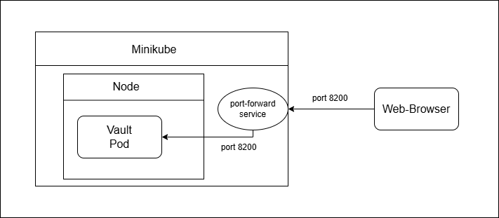

University: [ITMO University](https://itmo.ru/ru/) \
Faculty: [FICT](https://fict.itmo.ru) \
Course: [Introduction to distributed technologies](https://github.com/itmo-ict-faculty/introduction-to-distributed-technologies) \
Year: 2024/2025 \
Group: K4111c \
Author: Leshchenko Sergei Dmitrievich \
Lab: Lab1 \
Date of create: 19.10.2024 \
Date of finished: 31.10.2024

## Лабораторная работа №1 "Установка Docker и Minikube, мой первый манифест."

### Описание
Это первая лабораторная работа в которой вы сможете протестировать Docker, установить Minikube и развернуть свой первый "под".

### Цель работы
Ознакомиться с инструментами Minikube и Docker, развернуть свой первый "под".

### Ход работы
1) Установить Docker;
2) Установить Minikube;
3) Развернуть minikube cluster;
4) Скачать образ HashiCorp Vault;
5) Написать manifest для развертывания пода с образом HashiCorp Vault;
6) Создать сервис для доступа к данному контейнеру;
7) Прокинуть порт для доступа к контейнеру;
8) Найти токен для доступа к vault
9) Войти, используя токен.

### Выполнение работы
#### 1. Установка Docker
Docker — это платформа с открытым исходным кодом, которая позволяет разработчикам и системным администраторам автоматизировать развёртывание, масштабирование и управление приложениями в контейнерах.

Контейнеры — это изолированные среды, в которых приложения работают с необходимыми для них зависимостями (например, библиотеками, настройками окружения), что обеспечивает консистентность и портативность между различными окружениями.

Docker был скачен с официального сайта https://www.docker.com/ и установлен на операционную систему Windows 11.

#### 2. Установка Minikube
Minikube — это инструмент, который позволяет локально разворачивать и управлять кластером Kubernetes на одной машине. Minikube разворачивает одноузловый Kubernetes-кластер на устройстве, что позволяет тестировать приложения в Kubernetes-среде без необходимости настраивать кластер в облаке или в более сложной инфраструктуре.

Minikube был скачен с официального сайта https://minikube.sigs.k8s.io/docs/start/ и установлен на операционную систему Windows 11.

#### 3. Развертывание minikube cluster
Развертывание осуществлялось при помощи следующей команды:
```bash
minikebe start
```
Результат ее выполнения представлен ниже:


#### 4. Загрузка образа HashiCorp Vault
Загрузка образа осуществлялась при помощи следующей команды:
```bash
docker pull vault:1.13.3
```
В данной команде необходимо было указать конкретную версию, без указания происходила ошибка. После выполнения данной команды образ был успешно загружен:


#### 5. Создание Manifest для развертывания пода с образом HashiCorp Vault
Для развертывания пода с образом HashiCorp Vault был создан файл-манифест [vault-pod.yaml](vault-pod.yaml), его содержимое представлено ниже:
```yaml
apiVersion: v1
kind: Pod
metadata:
  name: vault
  labels:
    name: vault
spec:
  containers:
  - name: vault
    image: vault:1.13.3
    ports:
    - containerPort: 8200
```
#### 6. Создание сервиса для доступа к данному контейнеру
В начале нужно создать соотвествующей объект в кластере kurbernets, для этого используется следующая команда:
```bash
minikube kubectl -- apply -f vault-pod.yaml
```
Результат ее выполнения представлен ниже:

Далее выполняется команда:
```bash
minikube kubectl -- expose pod vault --type=NodePort --port=8200
```
Данная команда создает сервис для пода vault. Сервис будет перенаправлять трафик на под vault через порт 8200. Результат выполнения команды представлен ниже:


#### 7. Прокидывание порта для доступа к контейнеру
Далее устанавливается соединение между портом 8200 на локальной машине и портом 8200 сервиса vault, который работает внутри кластера Kubernetes. Для этого была выполнена следующая команда:
```bash
minikube kubectl -- port-forward service/vault 8200:8200
```
Результат выполнения команды представлен ниже:


Теперь можно получить доступ к сервису по адресу localhost:8200:


#### 8. Поиск токена для доступа к vault
Сам ключ хранится отображается в логах контейнера в поде, для вывода логов была использована следующая команда:
```bash
minikube kubectl logs vault
```
В результате получаем логи, в которых содержится ключ:


#### 9. Осуществление входа при помощи найденного токена
Далее при помощи полученного токена был успешно осуществлен вход:


### Диаграмма организации
