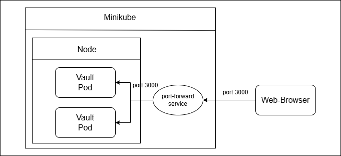

University: [ITMO University](https://itmo.ru/ru/) \
Faculty: [FICT](https://fict.itmo.ru) \
Course: [Introduction to distributed technologies](https://github.com/itmo-ict-faculty/introduction-to-distributed-technologies) \
Year: 2024/2025 \
Group: K4111c \
Author: Leshchenko Sergei Dmitrievich \
Lab: Lab2 \
Date of create: 01.11.2024 \
Date of finished: 07.11.2024

## Лабораторная работа №2 "Развертывание веб сервиса в Minikube, доступ к веб интерфейсу сервиса. Мониторинг сервиса."
 
### Цель работы

Ознакомиться с типами "контроллеров" развертывания контейнеров, ознакомится с сетевыми сервисами и развернуть свое веб приложение. 

### Ход работы

1) Создать `deployment` с 2 репликами контейнера [ifilyaninitmo/itdt-contained-frontend:master](https://hub.docker.com/repository/docker/ifilyaninitmo/itdt-contained-frontend) и передать переменные в эти реплики: `REACT_APP_USERNAME`, `REACT_APP_COMPANY_NAME`.
2) Создать сервис через который будет доступ на эти "поды". Выбор типа сервиса остается на ваше усмотрение. 
3) Запустить в `minikube` режим проброса портов и подключиться к контейнерам через веб браузер.
4) Проверить на странице в веб-браузере переменные `REACT_APP_USERNAME`, `REACT_APP_COMPANY_NAME` и `Container name`. Изменяются ли они? Если да то почему?
5) Проверить логи контейнеров, приложите логи в отчёт.

### Выполнение работы
#### 1. Создание Deployment
В Kubernetes Deployment — это объект, который управляет развертыванием и обновлением реплик подов (Pods). Он представляет собой контроллер, позволяющий автоматически создавать и поддерживать нужное количество подов с нужными версиями контейнеров. Основные задачи Deployment — обеспечить надежное и предсказуемое развертывание, обновление и откат версий приложений.

В начале создается [конфигурационной файл](./deployment.yaml), в нем задается тип объекта `kind`, его идентификатор `name`, количество реплик `replicas`, а также спецификация контейнеров, которая включается в себя образ `image`, имя контейнера `name`, и переменные окружения `env`.

Для создания объекта Deployment в Kubernates была использована следующая команда:
```bash
minikube kubectl -- apply -f deployment.yaml
```
В результате после выполнения данной команды были созданы два pods и объект deployment:


#### 2. Создание сервиса
Для создания сервиса была выполнена следующая команда:
```bash
minikube kubectl -- expose deployment lab2-deployment --port=3000 --name=lab2-service --type=ClusterIP
```
Тип сервиса указан `ClusterIP`, данный тип означает, что сервис будет доступен только внутри кластера Kubernetes.
#### 3. Проброс портов
Для проброса портов была выполнена следующая команда:
```bash
minikube kubectl -- port-forward service/lab2-service 3000:3000
```

#### 4. Проверка в браузере
При переходе по адресу `localhost:3000` открывается следующая страница:

Переменные `REACT_APP_USERNAME` и `REACT_APP_COMPANY_NAME` не изменяются, так как это переменные среды, которые были заданы при создании объекта deployment, обе эти переменные соовтественно описаны в файле [deployment.yaml](deployment.yaml). Переменная `Container name`, может изменяться в зависимости от того, к какому из контейнеров произошла переадресация из браузера. В данной работе переадресация происходила к одному и тому же контейнеру.
#### 5. Проверка логов контейнера
Логи обоих контейнеров представлены ниже:


### Диаграмма организации
