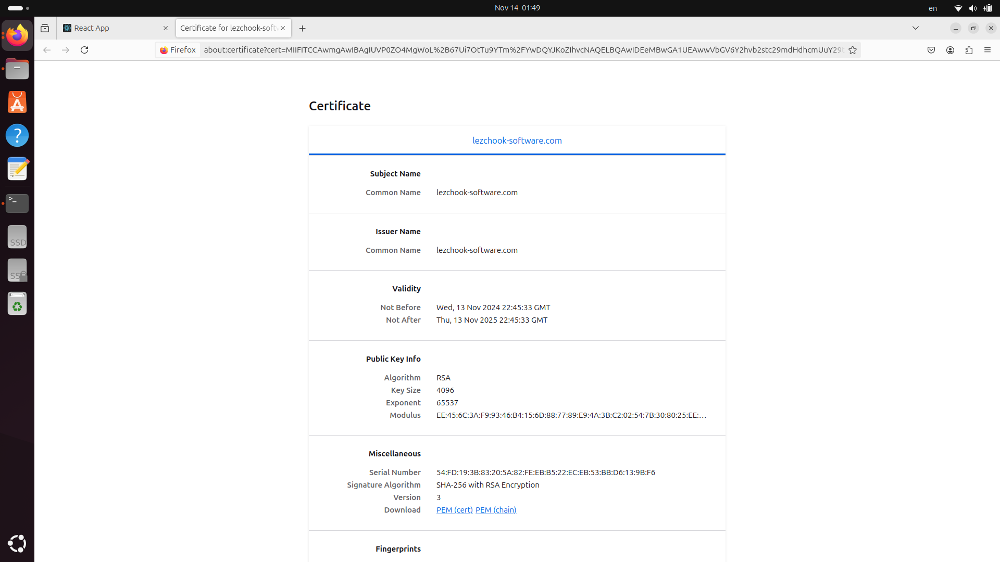

University: [ITMO University](https://itmo.ru/ru/) \
Faculty: [FICT](https://fict.itmo.ru) \
Course: [Introduction to distributed technologies](https://github.com/itmo-ict-faculty/introduction-to-distributed-technologies) \
Year: 2024/2025 \
Group: K4111c \
Author: Leshchenko Sergei Dmitrievich \
Lab: Lab3 \
Date of create: 14.11.2024 \
Date of finished: 14.11.2024

## Лабораторная работа №3 "Сертификаты и "секреты" в Minikube, безопасное хранение данных."

### Цель работы
Познакомиться с сертификатами и "секретами" в Minikube, правилами безопасного хранения данных в Minikube. 

### Ход работы
1) Создать ConfigMap с переменными среды `REACT_APP_USERNAME` и `REACT_APP_COMPANY_NAME`;
2) Создать ReplicaSet с 2 репликами контейнера `ifilyaninitmo/itdt-contained-frontend:master`;
3) Включить Ingress и создать TLS-сертификат;
4) Создать Ingress, который будет использовать сервис и секрет с TLS-сертификатом;
5) Настроить `HOSTS`;
6) Проверка результатов.

### Выполнение работы
#### 1. Создание ConfigMap
В начале создается конфигурационный файл [configmap.yaml](./configmap.yaml), в котором задаются значения для переменных среды: `REACT_APP_USERNAME` и `REACT_APP_COMPANY_NAME`.

 Затем после создания файла создается сам объект ConfigMap в среде k8s с помощью следующей команды:
```bash
minikube kubectl -- apply -f configmap.yaml
```

#### 2. Создание ReplicaSet
На основе ReplicaSet работает Deployment, основное отличии между ними в том, Deployment поддерживает механизмы управления версиями, например, откат к предыдущем версиям. В конфигурационном файле [deployment.yaml](./deployment.yaml) описывается конфигурация объекта ReplicaSet. Также в конце указывается ранние созданый объект lab3-configmap, который содержит переменные среды.

После создания файла создается объект ReplicaSet в среде k8s при помощи следующей команды:
```bash
minikube kubectl -- apply -f deployment.yaml
```

#### 3. Включение Ingress и создание TLS-сертификата
Ingress - это объект Kubernetes, который управляет внешним доступом к сервисам внутри кластера. Он позволяет направлять HTTP(S)-запросы к нужным сервисам на основе правил, например, URL или хост-направления. 

Основные функции Ingress:
1) Маршрутизация трафика. Позволяет определить, какие запросы должны быть направлены к каким сервисам на основе доменов или путей;
2) Обработка SSL/TLS. Поддерживает безопасное соединение при помощи сертификатов, что позволяет шифровать трафик;
3) Балансировка нагрузки. Распределяет входящий трафик между репликами приложения.

Для включения Ingress была выполнена следующая команда:
```bash
minikube addons enable ingress
```
TLS-сертификат (Transport Layer Security) - это цифровой сертификат, используемый для шифрования соединений между клиентами и серверами, обеспечивая защиту передаваемых данных. TLS-сертификат помогает удостоверить подлинность сайта или сервиса, гарантируя пользователям, что их данные передаются безопасно.

В Kubernetes TLS-сертификаты часто применяются вместе с Ingress для организации HTTPS-соединений, обеспечивая безопасное подключение к сервисам внутри кластера. Для этого сертификаты добавляются в кластер Kubernetes в виде Secret-объектов и привязываются к Ingress-ресурсам, чтобы шифровать трафик.

Для создания TLS-сертификата была выполнена следующая команда:
```bash
openssl req -new -newkey rsa:4096 -x509 -sha256 -days 365 -nodes -out MyCertificate.crt -keyout MyKey.key -subj "/CN=lezchook-software.com"
```
Данная команда создает самоподписанный сертификат MyCertificate.crt и соответствующий ему закрытый ключ MyKey.key, привязанный к домену lezchook-software.com.

Затем данный сертификат импортируется в k8s, как объект secret, с помощью следующий команды:
```bash
minikube kubectl -- create secret tls app-tls --key tls.key --cert tls.crt
```

#### 4. Создание Ingress
Теперь создается объект Ingress, который использует сервис приложения и секрет с TLS-сертификатом, конфигурация данного объекта описывается файлом [ingress.yaml](./ingress.yaml).

Перед созданием объекта Ingress нужно создать сервис, его можно так же описать при помощи конфигурационного файла, однако в данном случае для его создания по аналогии с предыдущими лабораторными была применена следующая команда:
```bash
minikube kubectl -- expose replicaset lab3-deployment --port=3000 --name=lab3-service --type=ClusterIP
```


После создания сервиса и конфигурационного файла создается объект Ingress при помощи команды:
```bash
minikube kubectl -- apply -f ingress.yaml
```

#### 5. Настройка `HOSTS`
Для начало нужно узнать IP-адрес, на котором работает minikube, это было сделано при помощи следующей команды:


Затем была добавлена конфигурация в файл `/etc/hosts`:


#### 6. Проверка результатов
При переходе по адресу `lezchook-software.com` отображется следующая страница:


Также можно посмотреть содержиое TLS-сертификата:


Как можно заметить у сертификата параметры совпадают с теми, что задавались при его создании, например, срок действия на 365 дней и шифрование с длиной ключа 4096 бит.

### Диаграмма организации
