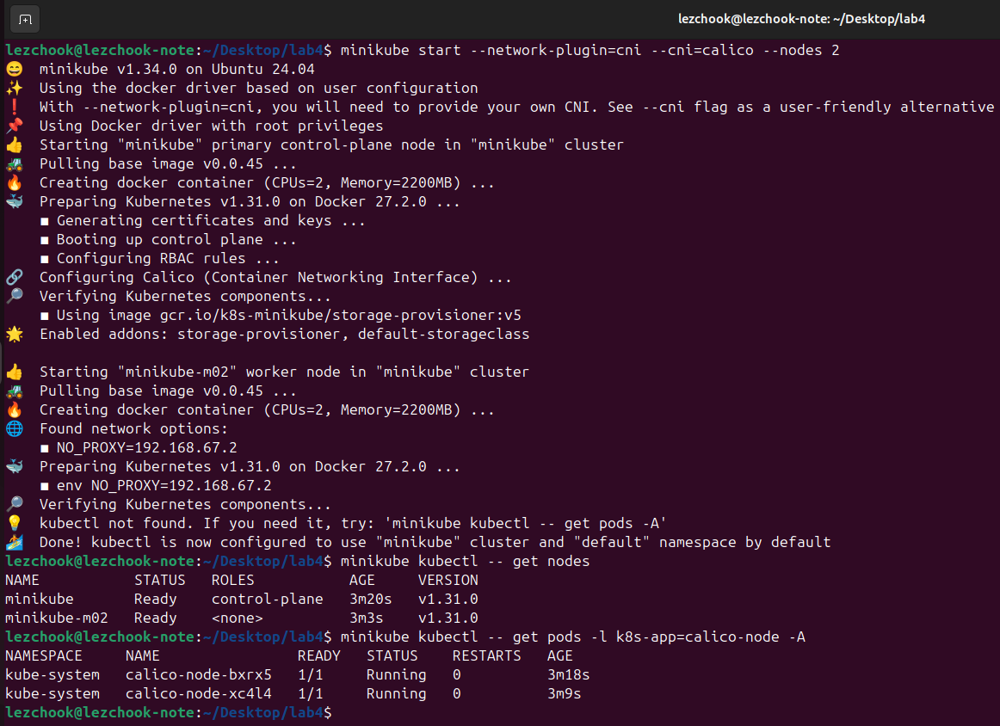
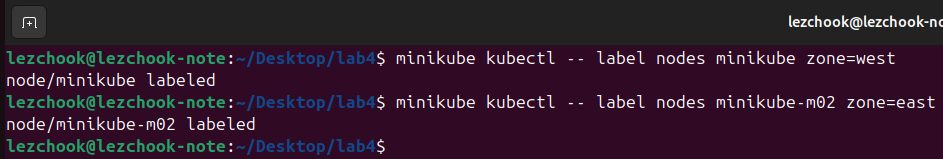
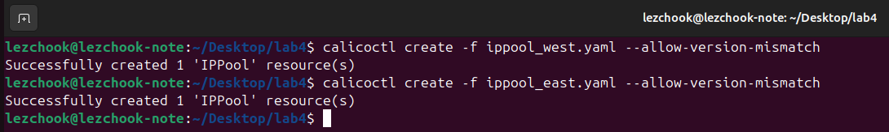
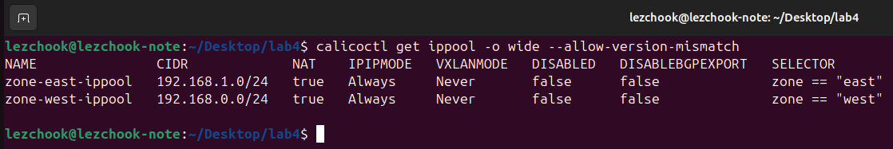
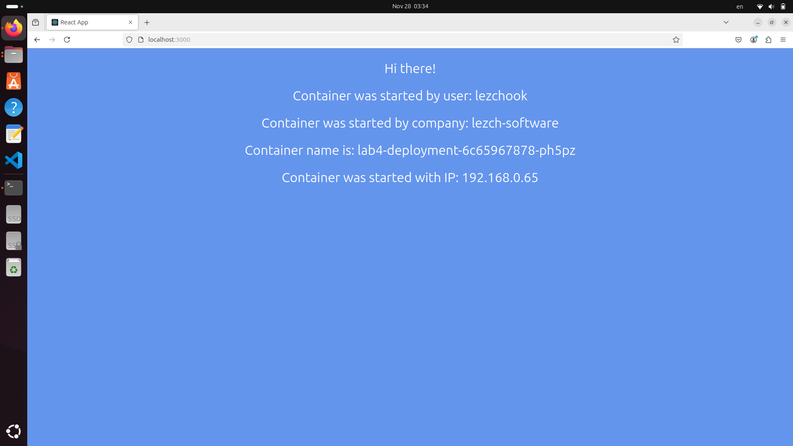
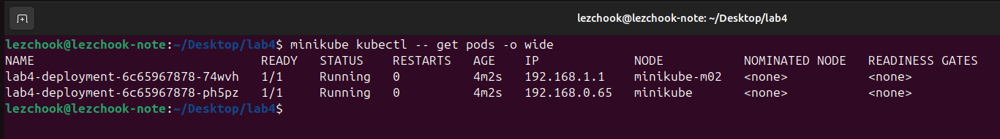
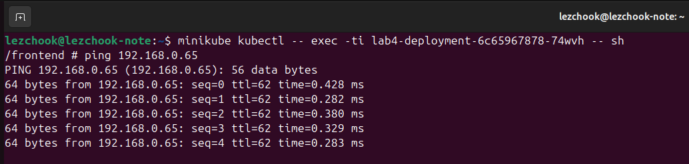
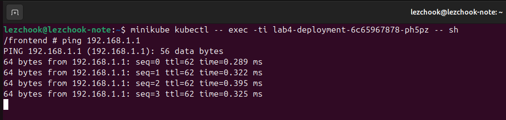
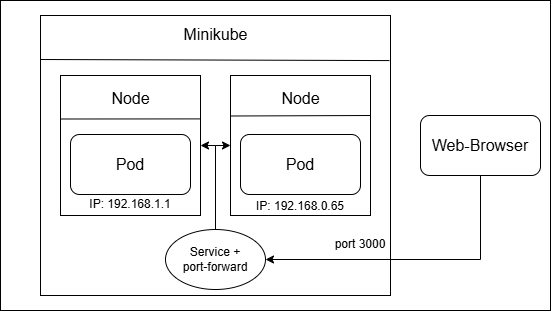

University: [ITMO University](https://itmo.ru/ru/) \
Faculty: [FICT](https://fict.itmo.ru) \
Course: [Introduction to distributed technologies](https://github.com/itmo-ict-faculty/introduction-to-distributed-technologies) \
Year: 2024/2025 \
Group: K4111c \
Author: Leshchenko Sergei Dmitrievich \
Lab: Lab4 \
Date of create: 21.11.2024 \
Date of finished: 28.11.2024

## Лабораторная работа №4 "Сети связи в Minikube, CNI и CoreDNS"
### Цель работы

Познакомиться с CNI Calico и функцией `IPAM Plugin`, изучить особенности работы CNI и CoreDNS.

### Ход работы
1. Запустить minikube вместе с плагином Calico;
2. Проверить работу CNI плагина Calico и количество нод;
3. Для запущеных ранее нод указать `label` по признаку стойки или географического расположения;
4. На основе ранее указанных меток назначить IP адреса "подам";
5. Cоздать `deployment` с 2 репликами контейнера [ifilyaninitmo/itdt-contained-frontend:master](https://hub.docker.com/repository/docker/ifilyaninitmo/itdt-contained-frontend) и передать переменные в эти реплики: `REACT_APP_USERNAME`, `REACT_APP_COMPANY_NAME`;
6. Создать сервис через который будет доступ на эти "поды";
7. Запустить в `minikube` режим проброса портов и подключиться к контейнерам через веб браузер;
8. Используя `kubectl exec` зайти в любой "под" и попробовать попинговать "поды" используя `FQDN` имя соседенего "пода", результаты пингов необходимо приложить к отчету

### Выполнение работы
#### 1. Запуск minikube
Запуск minikube был осуществлен с помощью следующей команды:
```bash
minikube start --network-plugin=cni --cni=calico --nodes=2
```
В данной команде указывается что minikube должен использовать стандарт CNI (Container Network Interface) для управления сетями в кластере Kubernetes, в качестве сетевого плагина CNI используется calico, также указывается, что создаются две рабочие ноды.

#### 2. Проверка работы

Как можно заметить, поды и ноды были успешно развернуты.

#### 3. Маркировка нод
Далее нодам был задан `label` на основании их условного георграфического расположения:


#### 4. Назначение IP адресов "подам"
В начале удаляются IP-пулы. которые были созданы по-умолчанию с помощью команды:
```bash
minikube kubectl -- delete ippools default-ipv4-ippool
```

Затем создаются конфигурационные файлы [ippool_east](ippool_east.yaml) и [ippool_west](ippool_west.yaml), в которых описывается пул IP-адресов для соотвествующих узлов с метками `zone=east` и `zone=west`. Далее с помощью команды calicoctl create создаются на основании описания в YAML-файлах новые объекты в Calico, в данном случае это IP-пулы.

Затем было проверено, что пулы были созданы:


#### 5. Создание Deployment
В начале создается конфигурационной файл [deployment.yaml](./deployment.yaml), в нем задается тип объекта `kind`, его идентификатор `name`, количество реплик `replicas`, а также спецификация контейнеров, которая включается в себя образ `image`, имя контейнера `name`, и переменные окружения `env`.

Для создания объекта Deployment в Kubernates была использована следующая команда:
```bash
minikube kubectl -- apply -f deployment.yaml
```

#### 6. Cоздание сервиса
Для создания сервиса была выполнена следующая команда:
```bash
minikube kubectl -- expose deployment lab4-deployment --port=3000 --name=lab4-service --type=ClusterIP
```
#### 7. Проверка работы
В начале был осуществлен проброс портов с помощью команды:
```bash
minikube kubectl -- port-forward service/lab4-service 3000:3000
```
Затем при переходи по адресу `localhost:3000` в браузере отображается следующая информация:

Как можно видеть, поду был присвоен адрес из пула, который был задан ранее. В данном случае подключение произошло к ноде с меткой `zone=east`.

#### 8. Пингование подов
В начале нужно узнать IP-адреса подов, делалось это с помощью следующей команды:

Затем к каждому из подов было осуществлено подключение и проверка доступности другого пода с помощью команды ping. Результат представлен ниже:



### Диаграмма организации
